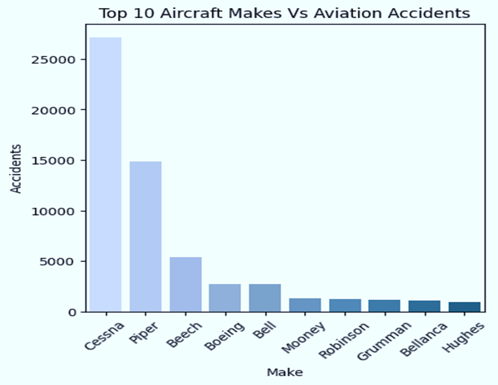
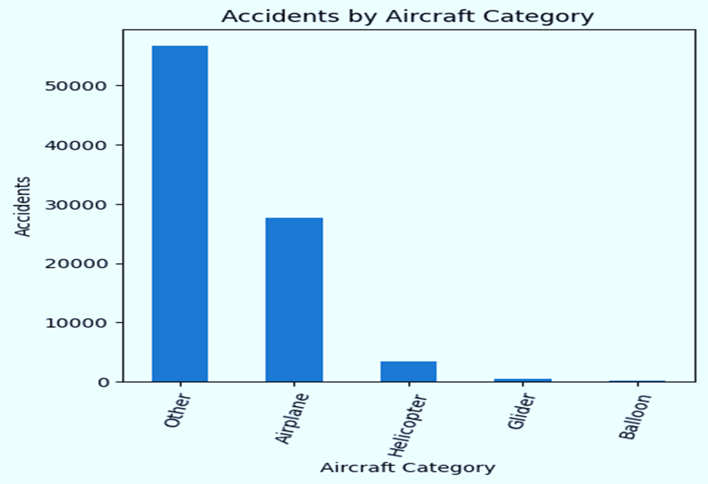

# DSF-PHASE-1-PROJECT
PROJECT OVERVIEW
This project outlines the analysis based on a dataset provided by the National Safety and Transport Board. 
It relays data on aviation accidents over the past decades (1962-2022). 

BUSINESS UNDERSTANDING
Over the past decades, the rates of aviation accidents have been influenced by various factors, such as aircraft make and model. 
Understanding how these factors correlate provides actionable insights into improving aviation safety, identifying design flaws, and implementing better operational protocols. 
This analysis can guide manufacturers and stakeholders to make data-driven decisions for risk regulation and enhance safety.

OBJECTIVES
Main objective:
To analyze and interpret accident trends over the past decades

Specific objectives:
Identify factors that have led to aviation accidents based on aircraft parameters such as make, model, their correlation, and aircraft category
Identify factors that have led to aviation accidents region-wise based on countries and accidents recorded in various regions
How various makes have made an impact on various based on injuries recorded from each make
Identify the trends yearly over the past decades based on aviation accidents

MY ANALYSIS
The dataset is based on trends of aviation accidents done by the National Transport and Safety Board(NTSB). Here is the dataset 
[text](<../PHASE 1 PROJECT/Clean Aviation Accidents Data.csv>)
This analysis will be based on the top key factors that influence aviation accidents these parameters are:
Top 10 aircraft makes with the most aviation accidents
Top 15 aircraft models with the most aviation accidents
Top 5 aircraft categories with the most aviation accidents
Top 5 main Broad phase of flight with the most accidents
Top 5 countries with the most aviation accidents
Top 5 makes with total number of injuries recorded
Top 3 aircraft makes and models and how their correlation have impacted aviation accidents
The trend of aviation accidents over the past decades

Here are some of the visualizations I used for my analyis

Some of the finding from my analysis are:
From my analysis, it is evident that the Cessna and Piper have the most number of accidents with each having a record exceeding 10,000. 
From my analysis it is evident that the United States of America has recorded the highest number of accidents with a whooping 80,000.
It is evident that from my analysis the Cessna, Boeing and the Piper lead the pack based on injuries recorded.
